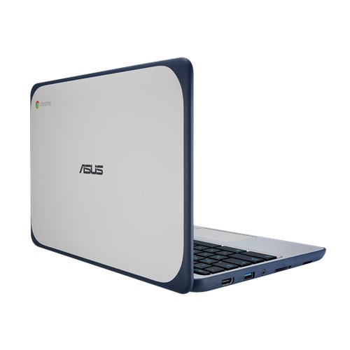
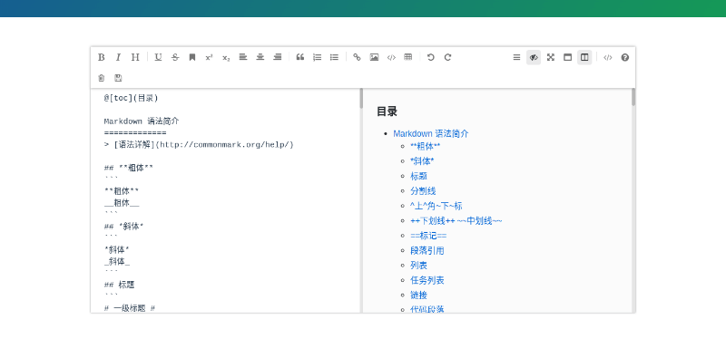

# 01 - 私のChromebookのために

  
(c) [AsusTek Computer Inc.](https://www.asus.com/us/Commercial-Laptops/ASUS-Chromebook-C202SA/)

じー…。

『あ、あのー…』

じー…。

『煩悩にみちあふれたものすごい眼力を感じるんですが…』

「気のせいじゃないよ」『ひいー』

Chromebook C202SAは [C202SAと最後の2年間](https://jamcha-aa.github.io/c202sa) で加わった、私のかわいい相棒だ。控えめな性能と大きさに、多少の水や衝撃をものともしない頑丈さをもつ。ただひとつの欠点は2021年6月に公式サポートが切れてしまうことだ。そこで私はあと2年のあいだにどうすればこのコンピュータを使いつぶせるのか、隙あらば酷使してやろうと、日々獲物を見るような視線をC202SAに向けていた。そしてそんな目で睨まれるたび、C202SAはどんな仕打ちを受けるのかと怯えている。

それでも取り返しがつかないほど中身をいじくるつもりはなかった。Chromebookを仲間に迎えるにあたって私はひとつの約束をしていたからだ。

「ぐぎぎ…」

[Text](https://chrome.google.com/webstore/detail/text/mmfbcljfglbokpmkimbfghdkjmjhdgbg) のカーソルがずれ、食いしばった唇が裂けそうになる。違う。これは私の目の錯覚だ。錯覚…。そう必死に言い聞かせる私の形相に、C202SAが悲鳴をあげた。

「ご…こ…や…約…束…」

約束。それは『なるべく初期設定で使う』こと。C202SAは容量が16GBしかないので、Linuxのようにカスタマイズを追い求めるとすぐに一杯になってしまう。反対に、Chromebookではなるべくいじらず、ソフトウェアも標準でインストールされているものを使うように心がけようと考えた。そうすれば、Chrome OSの優秀な同期システムの助けも借りて、他のChromebookを使うときにも違和感なく操作することができる。

「…きえーっ」

[Text](https://chrome.google.com/webstore/detail/text/mmfbcljfglbokpmkimbfghdkjmjhdgbg) はカーソルと違う位置に文章をペーストした。違う！私の手がすべっただけだ！

>[カスタマイズしちゃうと、それ以降、他のマシンを使う場合も「いつものマシンと同じ使い心地」を求め、やはり同様のカスタマイズが必要になったりします。  
結果、マシンや環境が変わると、いつもカスタマイズ。カスタマイズに相当な労力と時間を費やすことになります。](https://k-tai.watch.impress.co.jp/docs/column/stapa/730357.html)

「ぐご…ご…」

最低限、GitとGitクライアントである [Magit](https://magit.vc) は導入したけれども、[Spacemacs](http://spacemacs.org) や [Node.js](https://nodejs.org/) などの開発環境は入れず、エディタもプリインストールされたGoogleChromeLabs謹製の [Text](https://chrome.google.com/webstore/detail/text/mmfbcljfglbokpmkimbfghdkjmjhdgbg) を利用してきた。

すべてはC202SAのために！

「だから！」

サイドバーを開閉したときにTextのカーソルキーが実際の位置と違ってしまったとしても！

「想定外の場所にテキストが貼り付けられてしまっても！」

 

「私は何も不満はない！！」

 

カチャン！

 

「…」

左の小指と薬指がわずかに痛む。`Ctrl + s` で保存した私の手は、だらりと垂れ下がった。

落ちくぼんだ双眸。やせこけた頬。

『ぼくのために無理しないで…』C202SAは今にも泣き出しそうな声で言った。

「約束だから」『そんなんじゃ、他のChromebookを使うまえに、あなたが』

「私は何も不満はないって言ってる…！」

振り上げた拳。けれどもそれは打ちつけられることはなく、ゆっくりと膝の上に落ちた。「でしょ…」

おかしいところなど何もない。何もないはずだ。なぜなら、どんな条件で不具合が起きるのか、私が説明できないのだから。狸に化かされているのだろうか？いずれにせよ、C202SAの言うとおり、文章を書く道具については他の手段を考えないと、いずれ生気を根こそぎ吸い取られ、干からびてしまうだろう。

 

「…」

 

ぼんやりした頭で考えた。C202SAに合った、文章を書く道具。あれこれ試して文句を言うばかりの自分が見えた。登録が面倒、遅い、インストールしたくない、フォントが汚い、裏で何してるかわからない、…。

ああおぞましい。そんな醜い姿になってしまうくらいなら、Textの特性を見切れるよう努力したほうがましだ。ぺっぺっ。

そんな投げやりな気持ちでGoogleの海をただよっていると、ひとつのソフトウェアが検索結果に表示された。いてもたってもいられなくなったC202SAが、こっそり差し入れしたのかもしれない。

[mavonEditor - A markdown editor based on Vue that supports a variety of personalized features](https://www.zhystar.com/)

mavon。(おそらく) ヒンディー語で「木の実」を意味するそれは、一見するとオンラインで使えるMarkdownエディタなのだが、その正体はVue.jsのコンポーネントだった。いわばエディタの部品だ。

私の全身に衝撃がはしった。

「そうか。文句があるなら作ればいいのか」

そんなことはつい先ほどまで考えてもみなかった。エディタといえば、テキストフォームを設置して、ボタンを設置して、それぞれの役割を書いて…。そうして手間ひまかけてようやくメモ帳程度の機能しか私には作れない、いや、そこまで到達することさえできないと思っていた。

けれどもmavonEditorはエディタを作るためのパーツが揃っている。まるでパソコンを組み立てるように、mavonEditorのパーツをあれこれいじって、自分好みのエディタに仕上げられるのだ。そうしてできたものは、まぎれもない、私のエディタだ。「作品は何を使って書いてるんですか？」という問いに、「自作のエディタを使ってます」と答えられるではないか。かっけー。

つくろう。

「エディタをつくろう」

あぜんとするC202SAをよそに、Vue.jsはおろかJavascriptさえまともに書けない私のエディタづくりが始まった。

 
 
(c) 2019 jamcha (jamcha.aa@gmail.com).

