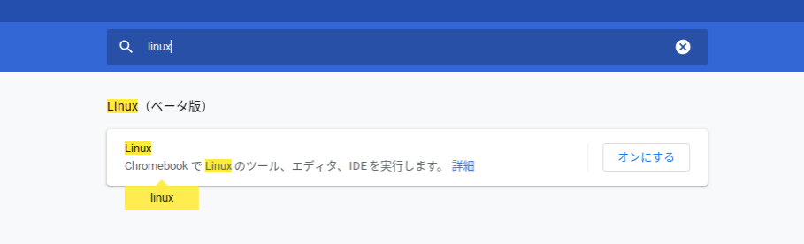
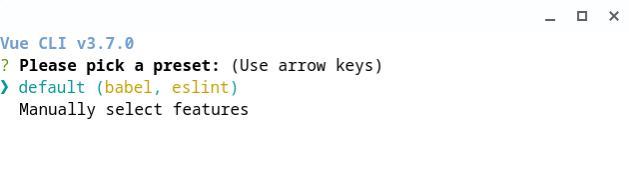
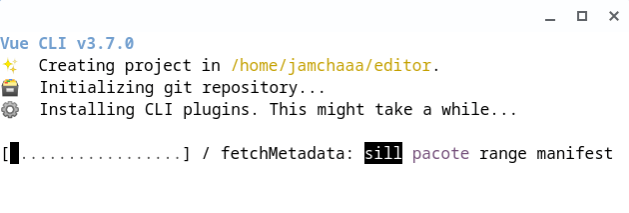
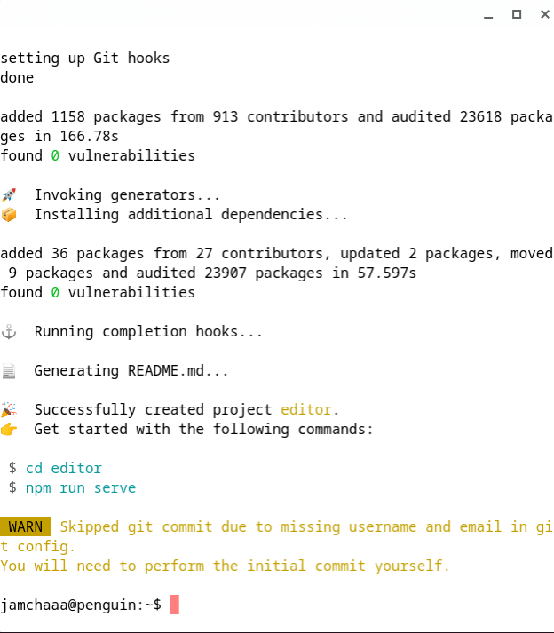
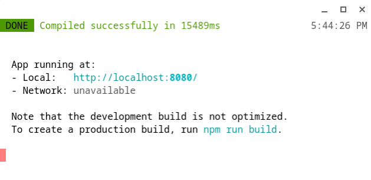
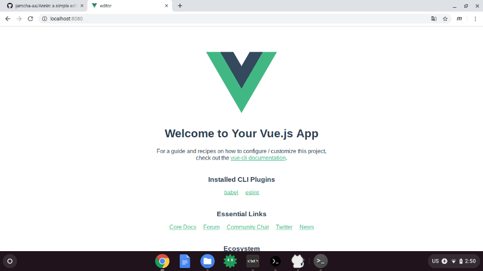
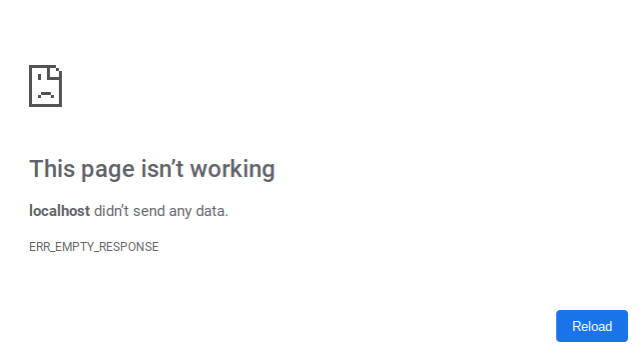

# 02 - ChromebookでVue

## Vue.jsのインストール

「Chromebookでエディタづくりに取りかかる前に、まずLinuxの機能を有効にしておこう」



「インストールが終わったらランチャーで『ターミナル』というのがあるので起動すると、禍々しい『あの黒い画面』が出る」  
『忌まわしい『あの黒い画面』ですね…』  
「『あの黒い画面』を避けては通れないので慣れましょう。インストールしたときはいくつかのソフトウェアが古いので更新しておく」

<br>

```sh
$ sudo apt update
```

「 `$` をのぞいた文字を入力してEnterキーを押す。するとコマンドが実行される。この場合は sudo apt update を入力してEnter」  
『わざわざ `$` を入れる意味はあるんですか？』  
「『あの黒い画面』で入力するコマンドだよ、という印」  
『なるほど。闇の印なんですね』  
「そう。忌むべき印。お、終わったみたい。それじゃあ次のコマンドを入力しよう」

<br>

```sh
$ sudo apt upgrade
```

「 `Do you want to continue? [Y/n]` みたいな表示が出るので `y` を押す」  
『けっこう更新に時間かかりますね…あ、終わりましたよ』

<br>

「[それじゃあ次に nodejs をインストールしよう](https://tecadmin.net/install-latest-nodejs-npm-on-debian/)。一行ずつ順番に実行します」

```sh
$ sudo apt install curl software-properties-common
$ curl -sL https://deb.nodesource.com/setup_12.x | sudo bash -
$ sudo apt install -y nodejs
```

『うーん、こんなに文字入力するの大変じゃないですか？』  
「タッチパッドで1行ずつコピペしてEnterを押してもいいよ」  
『へえ。キーボードじゃなくてもいいんですね』  
「そうそう。映画のハッカーみたいなタイピング能力がなくても大丈夫」

<br>

[](https://www.youtube.com/watch?v=M8qkL_7Lbyw)  
Programming in movies vs. programming in real life (via [YouTube](https://www.youtube.com/watch?v=M8qkL_7Lbyw))

<br>

『終わりました！』  
「おっけー。最後にVue.jsをインストールしよう」

```sh
$ sudo npm install -g @vue/cli
```

『なんかさっきと最初のコマンドが違いますね』  
「よく気づいたね。実はここから新たな世界に突入するのです」  
『新たな世界…』

## Vueを動かしてみる

「さっそくアプリを動かしてみよう」  
『はい！』  

```sh
$ vue create editor
```

『何か出ましたよ』



「そのままEnterでいいかな」  
『はい…おお！』



『なんか動いてますよ。かわいい』  
「君もね」  
『はい？』  
「なんでもない。時間がかかるからしばらく待とう」  
『はい！』

<br>

『あ、終わったみたいですよ』



<br>

「画面に `$` マークがあるのがわかる？」  
『はい。さっき見たやつですね。コマンドのしるし…ですか』  
「そうそう。指示どおりにやってみよう」

<br>

```sh
$ cd editor
$ npm run serve
```



『画面が動かなくなりました』  
「 "Compiled successfully" って書かれてるでしょ。だから成功したってこと。Chromeで `http://localhost:8080` ってページを開いてみよう」  
『はい。…ホームページが表示されました』

<br>



「これがさっきのコマンドで作られたページ」  
『え？そうなんですか？』  
「うん。試しに、『あの黒い画面』で終了させてみよう。 `Ctrl + c` を押してみて。`Ctrl` キーを押しながら `c` ね」  
『押しました』  
「それじゃあさっきのページをリロードしてみよう」  



『消えちゃいました』  
「ね。さっきのコマンドで作られたページだってわかったでしょ？」  
『はい』  
「これからこのファイルをいじってエディタにします」  
『こ、ここから、ですか…？』  
「そう。mavonEditorを動かすだけなら難しくない」  
『そうなんですね』  
「その先は私も知らない魔境」  
『…そうなんですね』  
「くじけそうになったら応援してね」  
『もちろんですよ！』

<br>
<br>
(c) 2019 jamcha (jamcha.aa@gmail.com).


