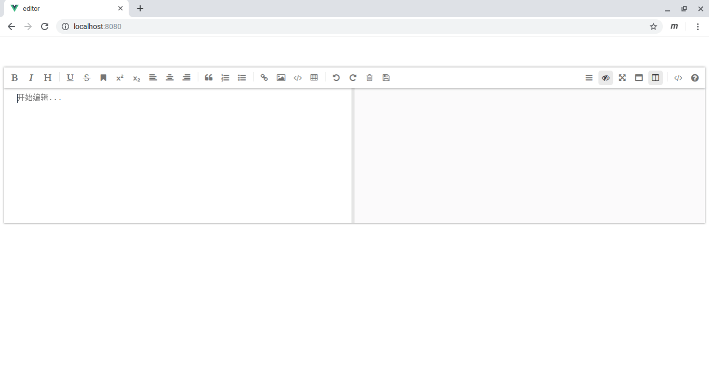

# 03 - いきなり完成！？

## ファイルの場所

「前回作ったプログラムは『ファイル』アプリの "Linuxファイル" の中に入ってます。アイコンがかわいいから見逃さないはず」


『あ！かわいー！』  
「でしょでしょ！」  
『モチっとしてる』  
「そそ。えっと、それでね、前回はeditorって名前でプログラムを作ったから、editorって名前のフォルダができてるはず。開いてみて」


『うーん、いろいろファイルがありますね…難しそう』  
「`src` の中身がわかれば大丈夫だよ」  
『え？そうなんですか？』  
「うん。とりあえず、中を見てみよう」  
『ファイルが2個あります』  
「ひとつずつ説明するね」

- App.vue: 部品
- main.js: 部品を動かす場所

『うーん、部品がひとつしかありませんけど、これで動くんですか？』  
「試してみよう。まずmain.jsを開いてみて」

## main.js を書き換える

```js
import Vue from 'vue'
import App from './App.vue'

Vue.config.productionTip = false

new Vue({
  render: h => h(App),
}).$mount('#app')
```

「真ん中のVue.config〜って行をmavonEditorが使えるように書き換えます」

```js
import Vue from 'vue'
import App from './App.vue'

import mavonEditor from 'mavon-editor'
import 'mavon-editor/dist/css/index.css'
Vue.use(mavonEditor)

new Vue({
  render: h => h(App),
}).$mount('#app')
```

『できました！』  
「おっけー。次にApp.vueを開いて」

## App.vue を書き換える

```vue
<template>
  <div id="app">
    
    <HelloWorld msg="Welcome to Your Vue.js App"/>
  </div>
</template>

<script>
import HelloWorld from './components/HelloWorld.vue'

export default {
  name: 'app',
  components: {
    HelloWorld
  }
}
</script>

<style>
#app {
  font-family: 'Avenir', Helvetica, Arial, sans-serif;
  -webkit-font-smoothing: antialiased;
  -moz-osx-font-smoothing: grayscale;
  text-align: center;
  color: #2c3e50;
  margin-top: 60px;
}
</style>
```

『なんか難しそう…』  
「だいじょぶ。書き換えるのは3行目と4行目だけだから」

```vue
<template>
  <div id="app">
    <mavon-editor style="height: 100%"></mavon-editor>
  </div>
</template>

<script>
import HelloWorld from './components/HelloWorld.vue'

export default {
  name: 'app',
  components: {
    HelloWorld
  }
}
</script>

<style>
#app {
  font-family: 'Avenir', Helvetica, Arial, sans-serif;
  -webkit-font-smoothing: antialiased;
  -moz-osx-font-smoothing: grayscale;
  text-align: center;
  color: #2c3e50;
  margin-top: 60px;
}
</style>
```

「これでよし」  
『え？これでいいんですか？ちょっと書き換えただけですけど』  
「そう。簡単でしょ。さっそく動かしてみようか。前回からターミナルを開いたままの人は次のコマンドを、一旦閉じた人は `cd editor` を実行してeditorフォルダに移動しておいてください」

## mavon-editor を動かす

```sh
$ npm run serve
```

『あれ、エラーが出ましたよ』

```sh
 ERROR  Failed to compile with 2 errors

These dependencies were not found:

* mavon-editor in ./src/main.js
* mavon-editor/dist/css/index.css in ./src/main.js

To install them, you can run: npm install --save mavon-editor mavon-editor/dist/css/index.css
```

「最後の文で『mavon-editorをインストールして』って言ってるね。一旦 `Ctrl + c` を押して終了して、mavon-editorをインストールしよう」

```sh
$ npm install --save mavon-editor
```
『 `$` は闇の印ですよね』  
「そうそう。だんだんわかってきた？ `$` が出てきたら、『あの黒い画面』でコマンド入力しろって合図」  
『はい！…あ、もう終わりましたよ』  
「それじゃ改めて動かそう」

```sh
$ npm run serve
```

…

```sh
 DONE  Compiled successfully in 13988ms

 
  App running at:
  - Local:   http://localhost:8080/ 
  - Network: unavailable

  Note that the development build is not optimized.
  To create a production build, run npm run build.
```

『今度はうまくいったみたいです』  
「じゃあChromeで `http://localhost:8080/` を開いてみよう」  
『はい。…おお！』

<br>



『すごい。もう動くんですかこれ？表記が中国語ですけど』  
「すごいでしょ。もう文章も書けるしmarkdownのプレビューもできるんだよ」  
『はい。表記が中国語ですけど』  
「私は使ってないけど画像の挿入もできるみたい」  
『そうなんですね…。でも表記が…』  
「仕方ないなあ。じゃあ表記を日本語にしよう。ありがたいことにmavonEditorは日本語がサポートされているので、App.vueの3行目に `language="ja"` を入れるだけで日本語表記にできます」

```vue
<template>
  <div id="app">
    <mavon-editor style="height: 100%" language="ja"></mavon-editor>
  </div>
</template>
```


『おー、メニューもすぐ日本語に変わりましたよ』  
「ね、簡単でしょ」  
『 "編集を始てね！" って、なんかかわいいですね』  
「『夕飯はドン勝だ！』みたいに味わいがあって大好きです。さっそく編集を始 (し) よう！」

<br>
<br>
(c) 2019 jamcha (jamcha.aa@gmail.com).


