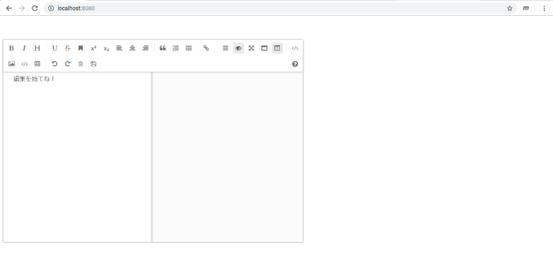
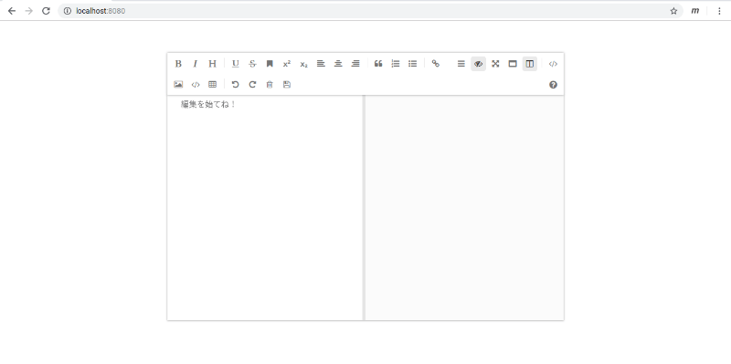

# 04 - サイズを変える


テキストエリアで点滅するキャレットを眺めながら、私は腕組みをしたまま考えこんでいた。

「うーん、画面が大きいかなあ。あとツールバーをもうちょっとシンプルにしたい」

そうして首を傾け、あきらめの表情をうかべる。

「でもどうすればいいかわからない」

『ええーっ！？』  

「しょうがないじゃん。Javascriptも書けないし、Vueのアプリを作ったのだって初めてなんだから」  

『説明書はないんですか…？』  

「ええー」

C202SAの言葉に私の口がへの字になる。

『ええーって』  
「ええー…」  
『そんな嫌そうな調子で言われましても…』  
「君が読んで教えてくれるならいいけどさあ」  
『そんな、無茶ですよ』  
「でしょ？君に無理なことが私にできるわけないんだって」  
『うーん…でも、読まずに進められないのなら、やはり読むしか…』

「はあーーーーーーーーー」

私はため息とも気を高める呼吸法ともとれぬ息を吐きながら、憎々しげな目でmavonEditorのドキュメントを開いた。

「オゥ」

さすがmavonEditor、公式のドキュメントにサイズ変更の方法が書かれている。

```vue
    <template>
        <div id="editor">
            <mavon-editor style="height: 100%"></mavon-editor>
        </div>
    </template>
    <script>
    // Local Registration
    import { mavonEditor } from 'mavon-editor'
    import 'mavon-editor/dist/css/index.css'
    export default {
        name: 'editor',
        components: {
            mavonEditor
            // or 'mavon-editor': mavonEditor
        }
    }
    </script>
    <style>
    #editor {
        margin: auto;
        width: 80%;
        height: 580px;
    }
    </style>
```

「へえー。 `style` とかいうタグのなかでサイズを指定できるらしいよ」  
『そうなんですね』  
「せっかく調べたんだからほめてよ」  
『さすがですね！』  
「でしょー」  
『…』  
「もっとほめて」  
『す…すごいです。私には到底およばない考えで…』  
「でしょー。あとね、もう少し褒め方のバリエーション増やしたほうがいいよ。君は褒め言葉の聖地アメリカから来たんだしさ」  
『…ええー。うーん、…チューリング以来の天才だ、とか言えばいいんですかね…』  
「それは言いすぎ」  
『…』

```vue
<template>
  <div id="app">
    <mavon-editor style="height: 100%" language="ja"></mavon-editor>
  </div>
</template>

<script>
import HelloWorld from './components/HelloWorld.vue'

export default {
  name: 'app',
  components: {
    HelloWorld
  }
}
</script>

<style>
#app {
  font-family: 'Avenir', Helvetica, Arial, sans-serif;
  -webkit-font-smoothing: antialiased;
  -moz-osx-font-smoothing: grayscale;
  text-align: center;
  color: #2c3e50;
  margin-top: 60px;
  width: 740px;
  height: 500px;
}
</style>
```



「うーん…」  
『左に寄せられちゃってますね』  
「そんなのわかってるよ」  
『すみません…あ、ほら、元のプログラムだと `margin: auto` っていうのがありますよ』  
「ほんとだ。これ入れればいいのかな」

```vue
  color: #2c3e50;
+ margin: auto;
  margin-top: 60px;
  width: 740px;
  height: 500px;
```



「おおー」  
『真ん中になりましたね！』  
「すごいじゃん、君」  
『へへ』  
「私みたいなへっぽこにはもったいないくらい優秀なパートナーだよ、ほんと」  
『照れちゃうな』  
「こういうふうに褒めればいいんだよ。わかった？」  
『…』  
「私にはもったいないくらい優秀なパートナーだと思ってるのはほんとだよ」  
『え！？ちょ、ちょっと！だめですよそんな言い方…反則です。…ああもう、調子狂っちゃうな…』

<br>
<br>
(c) 2019 jamcha (jamcha.aa@gmail.com).


