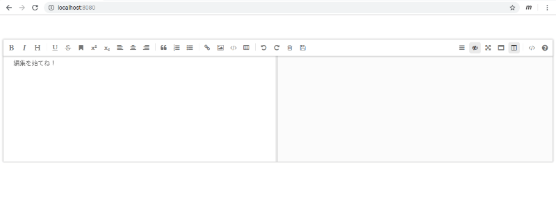

# 04 - サイズを変える

テキストエリアで点滅するキャレットを眺めながら、私は腕組みをしたまま考えこんでいた。

「うーん、画面が大きいかなあ。あとツールバーをもうちょっとシンプルにしたい」

そうして首を傾け、「でもどうすればいいかわからない」とお手上げの表情をした。

『ええーっ！？』  

「しょうがないじゃん。Javascriptも書けないし、Vueのアプリを作ったのだって初めてなんだから」  

『説明書はないんですか…？』  
「ええー」  
『ええーって』  
「ええー…」  
『そんな嫌そうな調子で言われましても…』  
「君が読んで教えてくれるならいいけどさあ」  
『そんな、無茶ですよ』  
「でしょ？君に無理なことが私にできるわけないんだって」  
『うーん…でも、読まずに進められないのなら、やはり読むしか…』

「はあーーーーーーーーー」

私はため息とも気を高める呼吸法ともとれぬ呼気を放ちながら、憎々しげな目でmavonEditorのドキュメントを開いた。

 
 
(c) 2019 jamcha (jamcha.aa@gmail.com).

