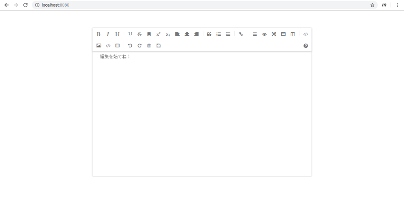

# 05 - すっきりツールバー

ゴン。

『痛っ！』  

「あ、ごめん。だいじょうぶ？」  

私が壁にぶつけてしまったC202SAの角をさする。ラバーが少しこすれてしまったようだ。

『いたた…』  
「ごめんね、ちょっとぼーっとしてて」  
『いえ、ぼくは丈夫ですから。あなたこそ、休まなくて大丈夫なんですか？最近ぶつけることが増えてるような気が』  
「マグロは泳ぐのをやめたらしんじゃうんだよ」  
『はぁ…』  

EeePCに聞いていたとおりの身の程知らずだ、とC202SAは思った。

『あなたが倒れたら、誰がぼくを壊れるまで使ってくれるんですか？』  
「地球最後の日に、地球が」  
『ちょっと』思わずC202SAが吹き出してしまう。『こっちは真面目な話してるのに、笑わせないでくださいよ』  
「あ、笑った？やったー」  
『そういうことで達成感を得ないでください。いいですか。あなたがしっかり休養を取るまで、ぼくを使うのは禁止ですからね』  
「は？そういう手に出るわけ？いいよ、そっちがその気なら、君を無慈悲な開発者モードに切り替えてやるから」  
『あー！だめです！絶対だめです！』  
「どうして」  
『ぼくが開発者モードになったら、ふだんあなたに言わず黙っていた気持ちを全部さらけだすことになりますよ。いいんですか』  
「うっ…」  

私の手がとまった。何を言われることになるのか想像はついている。もしそんなことを知ってしまったら、もう恐ろしくてC202SAに触れることができなくなってしまうかもしれない。

『ほらほら。やましいことがあるなら、今までどおりの関係でいたいなら、このままお休みなさいませ』  
「…わかったよ」  
『ほっ…』  
「かわりにさ」  
『はい？』  
「言いたいことがあるなら我慢しないで言っていいよ」  
『え…』  
「私が反省しないと、どんどんエスカレートしちゃうかもしれないから」  
『うーん、そうですか…。じゃあ、ひとつ言ってもいいですか？』  
「うん」  
『私を枕の横において寝るのはやめませんか。寝返りをうったときに、なんか、いろいろ付きます』  
「私色に染め」『られてもいいことはありません。やめましょう』  
「私の言い分も聞いて。本当は私は君を抱いて寝たいの。でも押しつぶしたり寝ぼけて投げて壊したりしたくないから仕方なく頭の横に置いてるわけ。外出るときだってね、腕にはめてスマートChromebookにしたいくらいなんだよ」  
『へ、へえー、スマートChromebookですか…。いい盾になりそうですね…。敵は何でしょうね…』  
「とりあえずは現実かな」  
『勝ち目がないじゃないですか』  
「いいツッコミだね。私が凍死しないで済んだよ。ありがとう」  
『どういたしまして』  
「寝ようか」  
『はい。おやすみなさい』

パチリ。

 

＊＊＊＊

 

「うーん、ツールバーでいらないアイコン消したいんだけどどうすればいいんだろう」すりすり  
『ええっと、ちょっと、恥ず…あの、説明書には書かれていないんですか…』すりすり  
「ルールを知らないゲームでカードを渡された感じ。どう使えばいいかわからない」すりすり  
『

 
 
(c) 2019 jamcha (jamcha.aa@gmail.com).

