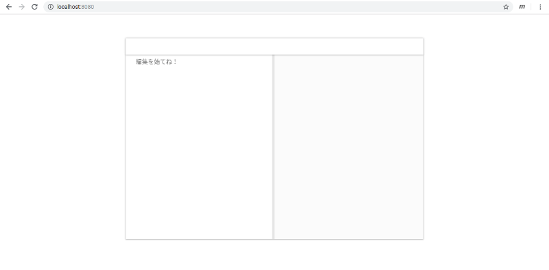

# 06 - その名は Annin (杏仁)

「うーん…」

エディタのツールバーからアイコンを消す方法。それをいまだ私は見つけられずにいた。

『どうですか？日本語の記事もいくつかあったようですけど…』  
「 `vue create` でできたプログラムと書き方が違うから何が違うのかどうすればいいのか何を書き換えればいいのか」  
『すみません！お邪魔でしたね…』  
私の気分を害したC202SAは、申し訳なさそうに声を引っ込めると、がんばって、と小さく応援した。

「あー！かわいいなあもう！！」

思わず拳をキーボードに叩きつけそうになった。本体は頑丈なC202SAでも、キーを支えるパンタグラフはそれほど衝撃に強くない。エンターなど重要なキーが破損したら大変だ。

<br>

「あ」

<br>

私があれこれ用語を変えて検索を続けていると、Googleが悟ったのか、ひとつのページを候補に入れてきた。中国における [Stack Overflow](https://stackoverflow.com/) だ。

[mavonEditor怎么删除不想要的多余图标](https://segmentfault.com/q/1010000012794420/a-1020000015628222)

「…わかったぞ」

`language="ja"` のように、ツールバーも `<mavon-editor>` で指定すればいいのか。私は回答と同じように、太字アイコンを消すのを試みた。

```vue
<template>
  <div id="app">
    <mavon-editor style="height: 100%" v-model="value" language="ja" :toolbars="toolbars"></mavon-editor>
  </div>
</template>

<script>
export default {
  name: 'editor',
  data() {
    return {
      value: '',
      toolbars: {
      bold: false, // 粗体
      }
    }
  }
}
</script>

<style>
#app {
  font-family: 'Avenir', Helvetica, Arial, sans-serif;
  -webkit-font-smoothing: antialiased;
  -moz-osx-font-smoothing: grayscale;
  text-align: center;
  color: #2c3e50;
  margin: auto;
  margin-top: 60px;
  width: 740px;
  height: 500px;
}
</style>
```



消えた。消えてしまった。全てのアイコンが。

『消えちゃいましたね…』  
「ツールバーの要素は全部指定しなきゃいけないのかな？」

私は改めてプログラムを書き換える。

```vue
<template>
  <div id="app">
    <mavon-editor style="height: 100%" v-model="value" language="ja" :toolbars="toolbars"></mavon-editor>
  </div>
</template>

<script>
export default {
  name: 'editor',
  data() {
    return {
      value: '',
      toolbars: {
      bold: false, // 粗体
      italic: true, // 斜体
      header: true, // 标题
      underline: true, // 下划线
      strikethrough: true, // 中划线
      mark: true, // 标记
      superscript: true, // 上角标
      subscript: true, // 下角标
      quote: true, // 引用
      ol: true, // 有序列表
      ul: true, // 无序列表
      link: true, // 链接
      imagelink: true, // 图片链接
      code: true, // code
      table: true, // 表格
      fullscreen: true, // 全屏编辑
      readmodel: true, // 沉浸式阅读
      htmlcode: true, // 展示html源码
      help: true, // 帮助
      /* 1.3.5 */
      undo: true, // 上一步
      redo: true, // 下一步
      trash: true, // 清空
      save: true, // 保存（触发events中的save事件）
      /* 1.4.2 */
      navigation: true, // 导航目录
      /* 2.1.8 */
      alignleft: true, // 左对齐
      aligncenter: true, // 居中
      alignright: true, // 右对齐
      /* 2.2.1 */
      subfield: true, // 单双栏模式
      preview: true, // 预览
      }
    }
  }
}
</script>

<style>
#app {
  font-family: 'Avenir', Helvetica, Arial, sans-serif;
  -webkit-font-smoothing: antialiased;
  -moz-osx-font-smoothing: grayscale;
  text-align: center;
  color: #2c3e50;
  margin: auto;
  margin-top: 60px;
  width: 740px;
  height: 500px;
}
</style>
```


「やった！消えたぞ！」小さく、着実な前進に胸が高鳴る。  
『おめでとうございます！』

こうなればこっちのものだ。私は公式のドキュメントを見ながら、自分に必要なアイコンだけを残してゆく。


「これでよし」

できあがった画面は簡素きわまりないものだった。

『あの…少し消しすぎなのでは…』C202SAも不安そうに声をかける。けれども私は満足して言った。「いいんだよ。Markdownの書き方は大体知ってるから」

私はdistraction-freeなエディタにこんな『外枠』がほしかった。枠がないと私の視線が泳いでしまうからだ。そして一行の幅はVuePressの標準出力と同じで、縦の幅はC202SAの画面に合った控えめなもの。かわいい相棒、Chromebook C202SAのために作った、私のエディタ。

私がそこへ文字を入力し、mavonEditorの優秀なプレビュー機能を堪能していると、『名前は決めたんですか？』とC202SAが嬉しそうにたずねてきた。

「名前？」『エディタのですよ。あなたが作ったエディタじゃないんですか』

「名前…」

ミルク色の見た目。『木の実』の名を冠するVueコンポーネント、mavonEditor。そこから連想されるもの…。

<br>

  
(c) Fumiaki Yoshimatsu, CC BY-SA 2.0

<br>

「Annin (杏仁)、っていうのはどうかな」『アンニン？』「ほら、杏仁豆腐って、中国発祥で、木の実をすりつぶしてできたデザートだから」

『Annin…はい、すてきな名前だと思います』  

「ありがと」

Annin。私はその名前を心の中で何度もつぶやいた。

『それじゃあ、せっかくAnninで書いた最初の文章ですから、消えないうちに保存しておかないと』

「え？保存なんてできないけど？」

<br>

『へ？』唖然とするC202SA。

<br>

「保存機能なんてあるわけないじゃん、もともとコンポーネントなんだから」  
『え…じゃあ、書いたものをどうやって保存するんですか？』  
「他のエディタにコピペして保存するんだよ」  

『…』  
「…」  
『…それ』  
「…それ以上言ったら泣くよ？いいの？」  
『もう泣いてるじゃないですか…』

<br>
<br>
(c) 2019 jamcha (jamcha.aa@gmail.com).


