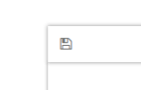
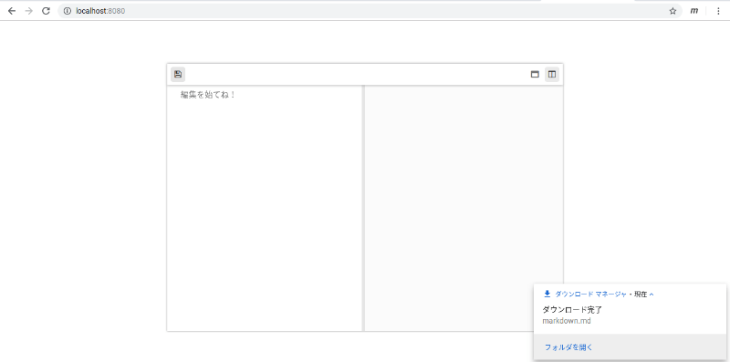
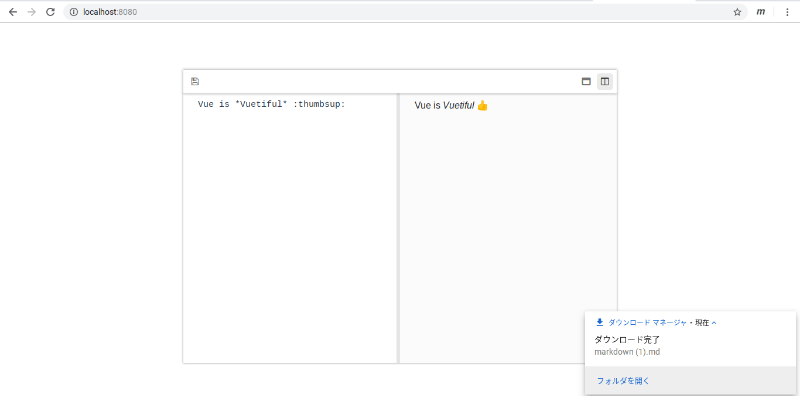
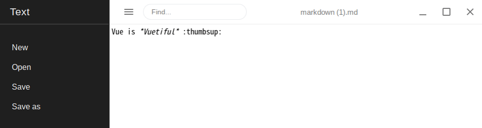

# 07 - 単なる着せ替えを超える



何の機能も持たない保存アイコン。それを押したところで反応が返ってくるはずもないのだが、私は未練たらしくそれを何度もクリックしていた。あまりにみじめな私の姿。

今や使われることもほとんどないフロッピーディスク、それを模したこのアイコンを押していれば、いずれ奇跡でも起きると思っているのだろうか。フロッピーが何なのかさえ知らないC202SAは、光を失った目でボタンを押し続ける私に声をかけられずにいた。しかし、私のパートナーであることを思い出し、勇気を振り絞って話しかける。

『あの、公式ページ？でしたっけ？そこでアイコン押すとどうなりますか…？』  
「保存アイコンを押したってダイアログが出る」ぶっきらぼうに私が答える。  
『その機能を調べる…とか』  
「無理だよ、Javascriptがわからないのに、どこにその機能が書かれてるのかつきとめるのも無理」  
『えっと、それじゃあ、ファイルのダウンロードってどうやってできてるのか、とか、どこかで紹介されてますよね。それを調べるのはどうですか？』  
「書かれてたってどうやってmavonEditorに応用すればいいのかわかんない」  
『うーん…』

はたからすれば『勝手にしろ』と愛想をつかされてもおかしくない、私の無礼な態度。けれども、C202SAは私が保存の方法を調べ、そのたびに肩を落とし、それでもまたGoogleの海へ飛び込んでいくのを見ていた。だから私の返事に文句を言うこともなかった。

『あの、他にAnninみたいなエディタを作ってる方はいないんですか？それで、今まで誰も保存をしようと思わなかったってことはないと思うんですけど』

「え？なんて？」

『すみません口下手で。えっと、Anninみたいなエディタを作ってる人は、どんなふうに保存してるんだろうと思って。みなさん、プログラムに詳しいなら、保存できるようにしますよね？ふつう』

「Anninみたいなエディタ…」

Anninみたいなエディタ。mavonEditorのようなVueコンポーネントを使ったエディタ…。

私はVue製のMarkdownエディタにしぼって検索をはじめた。

[Vue.jsでMarkdownのプレビューエディタとファイルダウンロード機能を作ってみた](https://helloworld-blog.tech/javascript/vue-js%E3%81%A7markdown%E3%81%AE%E3%83%97%E3%83%AC%E3%83%93%E3%83%A5%E3%83%BC%E3%82%A8%E3%83%87%E3%82%A3%E3%82%BF%E3%81%A8%E3%83%95%E3%82%A1%E3%82%A4%E3%83%AB%E3%83%80%E3%82%A6%E3%83%B3%E3%83%AD)

ダウンロードボタンを押すとファイルが保存される。このボタンをAnninの保存アイコンに置き換えられれば、うまくいくかもしれない。私は座り直してキーボードに向かった。

<br>

はじめは見様見真似でApp.vueにうつしてみた。 `<script>` タグの中で関数が書けるらしい。

[JavaScriptでファイルダウンロード機能を実装する](https://helloworld-blog.tech/javascript/javascript%E3%81%A7%E3%83%95%E3%82%A1%E3%82%A4%E3%83%AB%E3%83%80%E3%82%A6%E3%83%B3%E3%83%AD%E3%83%BC%E3%83%89%E6%A9%9F%E8%83%BD%E3%82%92%E5%AE%9F%E8%A3%85%E3%81%99%E3%82%8B)

```js
function fileDownload() {
    var blob = new Blob([ "aaa" ], { "type" : "text/plain" });
    let link = document.createElement('a')
    link.href = window.URL.createObjectURL(blob)
    link.download = 'sampleText.txt'
    link.click()   
}
```

`npm run serve`。しばらくして、`http://localhost:8080` にAnninが表示される。保存アイコンに変化はなかった。fileDownload関数とmavonEditor本体がつながっていないからだ。そこで、 [ソースコード](https://codepen.io/fffkm/pen/BqyMXr) でダウンロード関数とボタンがどうつながっているのかを確認する。

<br>

```vue
<md-button class="md-raised md-primary" @click="downloadMD">Download Markdown File</md-button>

...

downloadMD: function () {
    this.download('md')
}
...
```

ボタン (md-button) の中に書かれたクリック変数 (@click)。それに対応するdownloadMDが関数になっている。ただしこのまま使うことはできない。mavonEditorは単一のボタンではなく、様々な機能をもったコンポーネントだからだ。したがってこの関数を利用するには、mavonEditorの保存アイコンをクリックしたときに、中で何が起きているのかつきとめなければならない。

mavonEditorはどのようにしてアイコンと内部の機能を対応させているのだろう。私は公式のREADMEを読み直した。

[events](https://github.com/hinesboy/mavonEditor/blob/master/README-EN.md#events)

|  name | params | describe |
| :---: | :---: | :---: |
|  save | String: value , String: reder | Ctrl+s and click save button |

save。保存アイコンがクリックされると、このイベントが起動する。以前からこの存在は知っていたが、どう使えばよいのかわからなかった。たしか、ツールバーのアイコンを整理したとき、App.vueのなかでsaveが使われていたはずだ。手がかりを求め、私は前回参照したWebページに再度目をこらした ([mavonEditor怎么删除不想要的多余图标](https://segmentfault.com/q/1010000012794420/a-1020000015628222))。

`@save=save(content)`

そう。これだ。これをApp.vueの中に書くだけでは何も起こらない。だが今ならわかる。これはダウンロード機能を有効にするものではなく、先のクリック変数のように、`<script>`タグの中に書かれた関数を実行するものなのだ。

私は興奮する手でApp.vueにダウンロード関数を書き加えた。

```vue
<template>
  <div id="app">
    <mavon-editor style="height: 100%" @save="save" v-model="value" language="ja" :toolbars="toolbars" />
 </div>
</template>

<script>
export default {
  name: 'Annin',
  data() {
    return {
      value: '',
      toolbars: {
      bold: false, // 粗体
      italic: false, // 斜体
      header: false, // 标题
      underline: false, // 下划线
      strikethrough: false, // 中划线
      mark: false, // 标记
      superscript: false, // 上角标
      subscript: false, // 下角标
      quote: false, // 引用
      ol: false, // 有序列表
      ul: false, // 无序列表
      link: false, // 链接
      imagelink: false, // 图片链接
      code: false, // code
      table: false, // 表格
      fullscreen: false, // 全屏编辑
      readmodel: true, // 沉浸式阅读
      htmlcode: false, // 展示html源码
      help: false, // 帮助
      /* 1.3.5 */
      undo: false, // 上一步
      redo: false, // 下一步
      trash: false, // 清空
      save: true, // 保存（触发events中的save事件）
      /* 1.4.2 */
      navigation: false, // 导航目录
      /* 2.1.8 */
      alignleft: false, // 左对齐
      aligncenter: false, // 居中
      alignright: false, // 右对齐
      /* 2.2.1 */
      subfield: true, // 单双栏模式
      preview: false, // 预览
      }
    }
  },
  methods: {
    save: function () {
      this.download('md')
    },
    download: function () {
      var blob = new Blob([ "aaa" ], {'type': 'text/plain'})
      let link = document.createElement('a')
      link.href = window.URL.createObjectURL(blob)
      link.download = 'markdown.md'
      link.click()
    }
  }
}
</script>
  
<style>
#app {
  font-family: 'Avenir', Helvetica, Arial, sans-serif;
  -webkit-font-smoothing: antialiased;
  -moz-osx-font-smoothing: grayscale;
  text-align: center;
  color: #2c3e50;
  margin: auto;
  margin-top: 80px;
  width: 740px;
  height: 500px;
}
</style>
```

「よし」

画面に表示されているのは先と見かけ上は変わらないAnnin。ただし、もはやアイコンやウィンドウサイズを整理しただけのVueコンポーネントではない。私はタッチパッドを操作し、保存アイコンにポインターを向ける。C202SAも固唾をのんで私の表情を見守る、運命の一瞬。

<br>



保存された。歓喜するC202SA。それとは対照的に、私の心にあったのは、問題が解けたという穏やかな気持ちだった。

ダウンロードされたmarkdown.mdを開くと、設定された文字列 "aaa" だけが残されている。C202SAはハッとして、ぬか喜びだったかと口をつぐむ。このボタンは、今はただ "aaa" の三文字をmarkdown.mdというファイルに出力するだけだからだ。

けれども私はこの "aaa" を任意のテキストに置き換えるのはさほど難しくはないと思っていた。たしか、変数をわざわざ作らずに変数として振る舞ってくれる関数があったはず…。

[this](https://developer.mozilla.org/ja/docs/Web/JavaScript/Reference/Operators/this)

そう。this。これだ。`this.変数` の形で、"aaa" の代わりに文字列として振る舞ってくれる。

次に私はmavonEditorでテキストエリアの中身を指す変数を探った。

`v-model="value"`

>[form の input 要素 や textarea 要素、 select 要素に双方向 (two-way) データバインディングを作成するには、v-model ディレクティブを使用することができます。](https://jp.vuejs.org/v2/guide/forms.html)

valueはscriptの中でも記述されていた、mavonEditorとつながった変数だ。当初はAnninでアイコンを整理するために意味もわからず書き加えていたが、これがきっとテキストエリアを指すものに違いない。

私はプログラムの "aaa" を `this.value` に書き換えた。その内容をVueは瞬時に反映する。

<br>



Anninは再びmarkdown.mdをダウンロードさせる。私はそれをChromebookのデフォルトエディタ『Text』で開いた。

<br>



ダウンロードされたファイルには、私がAnninで入力したそのままの文章が保存されていた。

『あの…これ、できたんですか…？』震える声でC202SAが言う。  
「うん…できた。できたんだ。この私が」  

そう。AnninはmavonEditorの着せ替えから、保存機能をもったエディタに進歩したのだ。

『よかった…う、う、うえぇーん…』感極まったのか、泣きじゃくるC202SA。  
「ちょ、ちょっと、どうしたの」  
『だって…だって、さっきまで、しんじゃいそうな顔してたんですもん。心配しちゃいますよぉー…』  
「ええー…」

Anninに保存機能がないことを指摘したのはC202SAだった。もしかすると、そのことで私を追いつめてしまったと思ったのかもしれない。

かわいいやつめ。

<br>
<br>
(c) 2019 jamcha (jamcha.aa@gmail.com).


