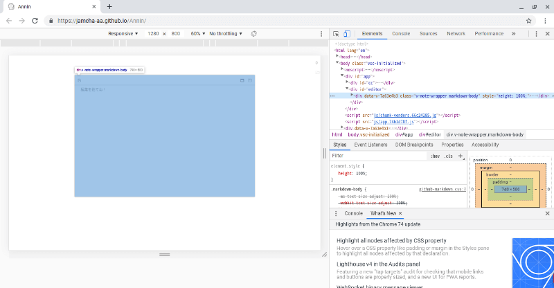
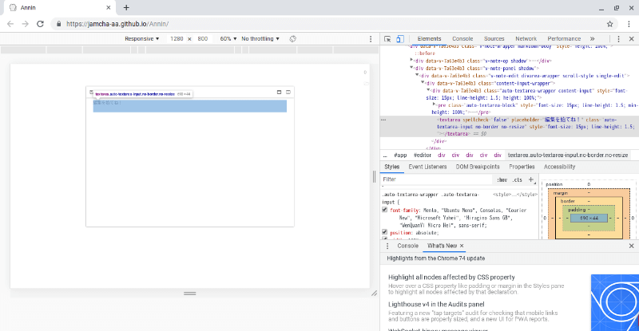
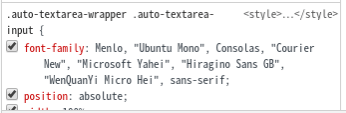
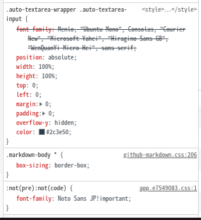
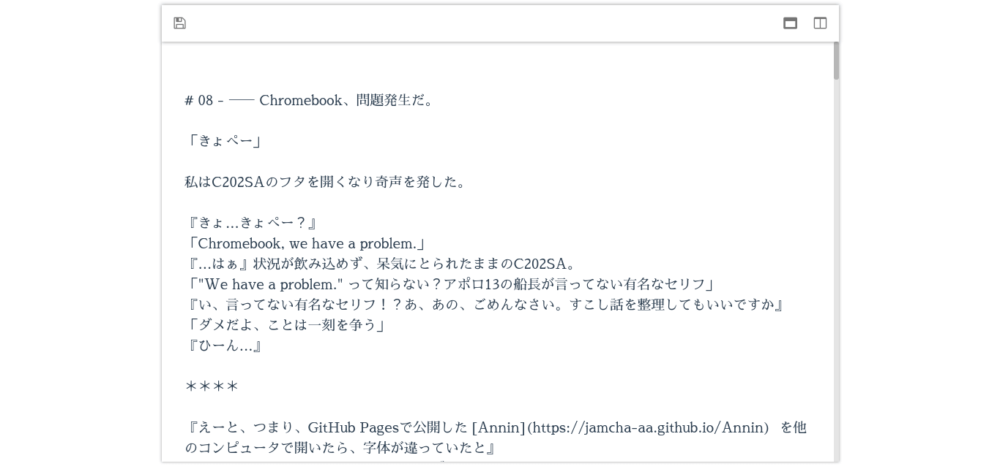

# 08 - —— Chromebook、問題発生だ。

「きょぺー」

その日、私はC202SAのフタを開くなり奇声を発した。

『きょ…きょぺー？』  
「Chromebook, we have a problem.」  
『…はぁ』状況が飲み込めず、呆気にとられたままのC202SA。  
「"We have a problem." って知らない？アポロ13の船長が言ってない有名なセリフ」  
『い、言ってない有名なセリフ！？あ、あの、ごめんなさい。すこし話を整理してもいいですか』  
「ダメだよ、ことは一刻を争う」  
『ひーん…』

＊＊＊＊

『えーと、つまり、GitHub Pagesで公開した [Annin](https://jamcha-aa.github.io/Annin)  を他のコンピュータで開いたら、字体が違っていたと』  
私はタオルで顔を覆い、こくこくとうなずく。  
『原因はわかったんですか？』  
私は首をかしげる。  
『うーん…、でも、直したほうがいいですよね…。すごくイヤそうに話してましたし…』  
首を横に振る私。  
『え？直さないんですか？』  
こくこく。  
『でも、他の方があなたと同じ思いをするかもしれないんですよ？』  
一瞬停止し、そして首を横に振る。

「だって…わからないんだもん…CSS…」

<br>

およそ四半世紀前に登場した [CSS](https://ja.wikipedia.org/wiki/Cascading_Style_Sheets) は、ウェブの世界に強力な表現力をもたらした。その革新性は、グラフィックにおけるプログラマブルシェーダや、UNIXにおける [CUPS](https://ja.wikipedia.org/wiki/Common_Unix_Printing_System) らとともにコンピュータの歴史に刻まれている。

けれどもChromeの開発ツールさえどう使えばよいのかわからない私に、CSSを書いて不具合を直せなんて無理だ。それにAnninはC202SAで使うために作った。C202SAなら思ったとおりに表示してくれる。C202SAだけ見ていればいい。つらいことだって忘れてしまえばいい…。

『うーん、敵の催眠術にかかった人みたいな言い方ですね…』  
「ちょっと、独り言を聞かないでよ」  
『うーん…この距離ではちょっと難しいです…』
「だめ。耳塞いで。まあ耳なんてないけど。それにさ、ちゃんとCSS設定して他のコンピュータでもAnninが使えるようになったら、君を使わなくなっちゃうかもしれないよ」  

『かまいません』  
「え？」  
『ぼくが壊れても、プログラムは残ります。あなたがぼくを使ってAnninを作ってくれたこと、その思い出だけで幸せなんですから』

<br>

ドォーッ。

<br>

目から豪雨が止まらない。本気？それ本気で言ってくれてるの？嬉しすぎて鼻も決壊しそう。

ずびー。

私は豪快に鼻をかむと、いきなり立ち上がり、何度もスクワットしてから頬を思いきり叩いた。

「よし！やろう！」  

『はい！』目に輝きを取り戻した私に、C202SAも元気よく返事をした。

<br>

＊＊＊＊

<br>



「狭いよ…」思わず出てしまった本音に、私はあわてて口を結ぶ。

『す、すみません…』

Chromeのデベロッパーツールを手探り状態で使いながら、私はC202SAの解像度1366 x 768というピンホールをとおして犯人を探していた。画面右のElementsに目をこらし、階層を下ってゆく。

「あ、これかな？」



見慣れた『編集を始 (し) てね！』の文字。視線をわずかに下に向けると、これまた見慣れた `font-family` の文字列。



mavonEditorの標準フォントはauto-textareaで指定されているようだ。それが何なのか検索する。

「あ、だめだ」

私はつぶやいて両足を投げ出した。そのまま身体をほぐすように、ゆらゆらとワカメのように揺れる。

『え？ちょっと、何が起きたんですか？』  
「私の手に負えない」

[auto-textarea](https://github.com/hinesboy/auto-textarea) はmavonEditorの中核をなす高性能パッケージだ。ここをAnnin用に書き直そうとすると、mavonEditor全体に影響が及んでしまう。

お手上げだ、と身体で示すように揺れつづける私。

『ふふっ』それを見ていたC202SAは思わず笑ってしまった。

「何がおかしいの。こっちは大変だってのに」  
『そうやってリラックスしてるときのあなた、きっとアイデアがありますよね？』

C202SAの言葉に動きを止めた私は、天井を見たままで答える。「そう。そうなの。うまくいくかもしれないんです」

よいしょ、と私は身体を起こし、Googleで検索した。

"qutebrowser フォント"

キーボードで軽快なブラウジングができる [qutebrowser](https://qutebrowser.org/) は、既定では東アジア言語のフォントにDroid Sans Fallbackを指定している。それだとあまり見栄えがよくないので、私は `stylesheet.css` を読み込ませて源ノ角ゴシックを表示させるようにしていた。だから同じようにすれば、Anninでもフォントを変更できるのではないかと思ったのだ。

```css
/* :set content.user_stylesheets '/home/user/stylesheet.css'  */
:not(pre):not(code) {
    font-family: "Noto Sans JP" !important;
}
```

『なんか "！" マークがついてて強そうですね』  
「 `!important` はフォントファミリを強制する恐ろしい魔法。gotoに匹敵するくらい怖い」  
『ええと、ゴートゥ？よくわかりませんけど、そんなの使っていいんですか？』  
「他に方法が思いつかないんだからしょうがないでしょ」  
『うーん…』

次に私は用意したcssファイルを読み込むよう、 [`main.js`](https://ashesrl.hatenablog.com/entry/2018/10/17/180946) の末尾に加えた。

```js
import Vue from 'vue'
import App from './App.vue'
import mavonEditor from 'mavon-editor'
import 'mavon-editor/dist/css/index.css'
Vue.use(mavonEditor)
new Vue({
  render: h => h(App),
}).$mount('#app')

require('./stylesheet.css')
```

<br>

「どうかな…？」

再びAnninのデベロッパーツールを起動する。



`auto-textarea` の情報が無事stylesheet.cssで上書きされている。もし源ノ角ゴシックがインストールされていないなら、OS標準のフォントが読み込まれることだろう。

『これで他の人が使っても大丈夫ですね』  
「たぶん」  
『あの、質問してもいいですか』  
「だめー」  
『えー…』  
「へへっ。なに？」  
『これ、他の字体にもできるんですよね？よければ、ちょっと、試してもらえませんか…』  
「いいよ、何にする？」  

[Google Fonts + 日本語](https://googlefonts.github.io/japanese/)

『それじゃあ…これ』  
「おっけー」

私はWebフォントを読み込むために `index.html` に一行書き加える。

```html
<!DOCTYPE html>
<html lang="en">
  <head>
    <meta charset="utf-8">
    <meta http-equiv="X-UA-Compatible" content="IE=edge">
    <meta name="viewport" content="width=device-width,initial-scale=1.0">
    <link rel="icon" href="<%= BASE_URL %>favicon.ico">
    <link rel="mask-icon" href="<%= BASE_URL %>favicon.svg">
    <title>Annin</title>
    <link href="https://fonts.googleapis.com/css?family=Sawarabi+Mincho" rel="stylesheet">
  </head>
  <body>
    <noscript>
      <strong>We're sorry but writer doesn't work properly without JavaScript enabled. Please enable it to continue.</strong>
    </noscript>
    <div id="app"></div>
    <!-- built files will be auto injected -->
  </body>
</html>
```

そして `stylesheet.css` を修正した。

```css
/* :set content.user_stylesheets '/home/user/stylesheet.css'  */
:not(pre):not(code) {
    font-family: "Sawarabi Mincho" !important;
}
```

Vueは変更を即座に反映する。



『わあ、こんなに雰囲気が変わるんですね』  
「ねー」  
『…しばらくこれでいきませんか？すごくかっこいいですよ』  
「うーむ…ちょっと考えさせてほしい」  
『あら、何か問題があるんですか？』  
「Chromebook, we have a problem.」

<br>
<br>
(c) 2019 jamcha (jamcha.aa@gmail.com).


