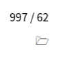
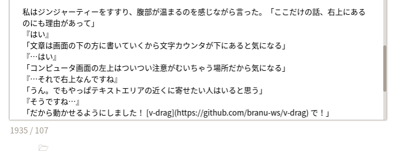

# 10 - Vueのデータバインディングなるもの

## 文字カウント機能

「そういえばたまたまなんだけどさ」  
『はい。何ですか？』  
「たまたまmavonEditorがVue製だったからなんだけどさ」  

『…はい』私の遠回しな言い方にC202SAは少しじれったい様子で返事をする。

「めんどくさいから後回しにしてた『文字数カウント』、1行でできちゃったんだよね」  
『ええー！？』  
「すごいでしょ」  
『は、はい…でもどうやったんですか？』  
「えっとね、前に、 `<mavonEditor>` のなかで `v-model="value"` って書いたでしょ？あれ書いたときは全然意味わからなかったんだけど、あれでVueのデータバインディングとかいう便利な機能が使えるらしくて」  
『う、うーん、そうなんですね…』  
「文字数を画面に表示したいなら `<template>` に1行書けばおしまい」

```vue
<p> {{ value.length }} </p>
```

「これでテキストエリアに文章を書くと勝手に文字数を表示してくれる」  
『え？これだけ？』  
「これだけ。あと単語数をカウントする場合もこれだけ」

```vue
<p> {{ value.trim().split(/\s+/).length }} </p>
```

「半角スペースで区切る処理を入れるから少し複雑だけど、でもこれだけ」  
『すごいですね…』  
「でしょ。でね、エディタだったらさ、やっぱり『ファイルを開く』って機能、欲しいじゃない？」  
『そうですね、保存ができるくらいですから…あ』

私の思っていることを察し、C202SAが訝しむ。『まさか…それもなんとかっていう機能で…』

「ふっふっふ…その通りでございます…」

## ファイルを開く機能

[Creating a Vue.js File Reader Component Using the FileReader API](https://alligator.io/vuejs/file-reader-component/)

「この記事に書かれたプログラムがMITライセンスだったのでそのまま使わせてもらいました。それで `App.vue` のscriptsのところにちょこっと書けばおしまい」

```vue

export default {

...

  components: {
    TextReader
  },
  
...
}
```

『ファイルを開くのになんとかっていう機能が使えるなら、ファイルを保存するのにも使えそうですね』  
「そうかもしれない…けど、余計なことを言わないでほしい…私がへっぽこなのを忘れないでほしい…」  
『す、すみません…』



「この文字カウントと単語カウント、それにファイルを開く機能は全部データバインディングのおかげ」  
『なんか、ほんとのエディタみたいですね』  
「あれ？何かすごく馬鹿にされたような」  
『きっ、気のせいです！ははは…あ、ちょっといいですか？』  
「なに」  
『ぼくの勘違いかもしれませんけど、色、薄くないですか？あと…』  
「どうしてこんな目につかないところにあるのかって？」  
『…はい』  
「わざとです」  
『そうなんですか』  
「文字打つたびに目の前で数字がちょこちょこ変わるなんて気が散って気が散って画面を付箋で」  
『ご、ごめんなさい！ぼくが悪かったです！少し休みましょ！ね！』

## v-drag

私はジンジャーティーをすすり、全身が温まるのを感じながら言った。「ここだけの話、右上にあるのにも理由がありまして」  
『はい』  
「文章は画面の下の方に書いていくから文字カウンタが下にあると気になる」  
『…はい』  
「あと画面の左上はついつい注意が向いちゃう場所だから気になる」  
『…それで右上なんですね』  
「うん。でもやっぱテキストエリアの近くに寄せたい人はいると思う」  
『そうですね…』  
「だから動かせるようにしました！ [v-drag](https://github.com/branu-ws/v-drag) で！」



『ええ！？なんかいきなりすごいんですが！？』  
「でしょ！ほめてほめて！」  
『すごい！ほんとにすごいです！』  
「あ、すごいのはv-dragなので、いちおう…。それで、やりかたなんだけど、まずtemplateのなかで動かしたいものを `v-drag` で囲みます」

```vue
    <div class="block" v-drag>
    
    ...
    
    </div>
```

「次にscriptのなかにちょこっと追加」

```vue
import drag from '@branu-jp/v-drag';

...

export default {

...

    directives: {
      drag
    }

...

}
```

「あとはblockのサイズとかをcssで書けばおしまい」  
『これ、Annin本体の位置も動かせそうですね』  
「そうそう。Photoshopみたいにね。Anninの画面サイズを自由に変えられるようになったら試すかもしれない」  
『楽しみです』  
「でもそれには君の画面がもっと広くならなきゃね」  
『無茶言わないでくださいよ…』

<br>
<br>
(c) 2019 jamcha (jamcha.aa@gmail.com).


